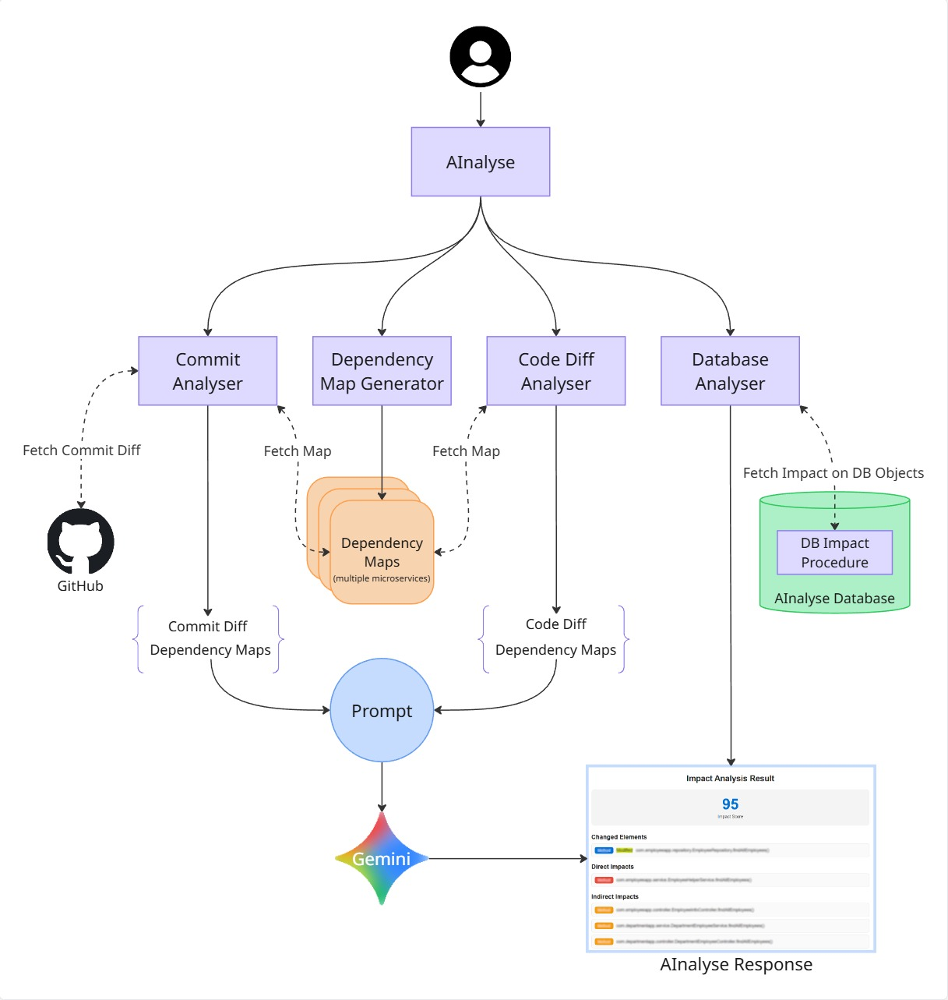

# 🤖 AInalyse
AInalyse is an intelligent, automated impact analysis tool designed to predict the ripple effects of code and database changes across multiple Java applications. By combining static code analysis with the reasoning capabilities of Google Gemini AI, AInalyse bridges the gap between raw code commits and architectural understanding.

It fetches live code changes (Git Diffs), maps them against pre-generated dependency graphs of your microservices, and uses Generative AI to calculate an impact score, identifying directly and indirectly affected modules, methods, and database entities.

# ✨ Key Features
Automated Dependency Mapping: Scans local Java projects (Abstract Syntax Tree parsing) to generate detailed JSON representations of classes, methods, API endpoints, and bean injections.

 - **AI-Powered Impact Analysis:**
	 - Uses Gemini 2.5 Flash to analyze code diffs in the context of the dependency graph.
	 - Identifies Direct Impacts (callers of modified methods).
	 - Identifies Indirect Impacts (transitive dependencies 2-5 levels deep).
	 - Calculates a probabilistic Impact Score (0-100).
 - **GitHub Integration:** Automatically fetches the latest commit diffs from specified repositories using the GitHub API.
 - **Database Impact Analysis:** Tracks changes to database schemas and procedures to identify affected application layers.
 - **Swagger/OpenAPI:** Built-in API documentation for easy testing and integration.

# Architecture

# 🛠️ Tech Stack

 - **Core:** Java 17, Spring Boot 3.1.4
 - **AI Model:** Google Gemini 2.5 Flash (google-genai client)
 - **Dependency Map:** JavaParser (com.github.javaparser)
 - **Database:** MySQL 8.0, Spring Data JPA
 - **Build Tool:** Maven
 - **Containerization:** Docker

# ⚙️ Configuration
Before running the application, configure the 
> src/main/resources/application.properties

    # Server Configuration
    server.port=8080
    spring.application.name=AInalyse
    
    # Google Gemini API Key (Required)
    gemini.api.key=YOUR_GEMINI_API_KEY
    
    # Directory where dependency map JSONs are stored/read from
    dependency.map.dir=D:/Work/DependencyMap
    
    # GitHub Owner Name (for default Repo fetching)
    ownerName=XeresArk
        
    # Database Configuration (MySQL)
    spring.datasource.url=jdbc:mysql://localhost:3306/ainalyse
    spring.datasource.username=root
    spring.datasource.password=your_password
    spring.datasource.driver-class-name=com.mysql.cj.jdbc.Driver
    
    # JPA/Hibernate
    spring.jpa.hibernate.ddl-auto=none
    spring.jpa.show-sql=true
    spring.jpa.database-platform=org.hibernate.dialect.MySQLDialect

  
  

# 🚀 Getting Started

## Prerequisites
- **Java 17** SDK installed.
- **Maven** installed.
- **MySQL** database running locally (create a schema named *ainalyse*).
- A **Google Gemini API Key** (Get one from Google AI Studio).

**Build and Run**
Clone the repository:

    git clone https://github.com/XeresArk/AInalyse.git
    cd AInalyse

**Build the JAR:**

    mvn clean package

**Run the application:**

    mvn spring-boot:run

  **Or run the JAR directly:**

    java -jar target/AInalyse-0.0.1-SNAPSHOT.jar

**Docker Support**
A Dockerfile is included for containerized deployment.

    # Build the image
    docker build -t ainalyse-app .
    
    # Run the container
    docker run -p 8080:8080 -e GEMINI_API_KEY="your_key" ainalyse-app

  
  

# 📡 API Documentation
Once the application is running, access the full Swagger UI at:
👉 http://localhost:8080/swagger-ui/index.html

# Primary Endpoints

**1. Generate Dependency Map**
Scans a local project and creates a dependency graph JSON file.
> POST /api/dependency-map/generateJson

Request Body:

    {
    "projectName": "EmployeeApp",
    "projectPath": "C:/Projects/EmployeeApp",
    "outputPath": "D:/Work/DependencyMap"
    }

**2.1. Analyze Latest Commit (The "Magic" Endpoint)**

Fetches the latest commit from GitHub, loads the specified dependency maps, and performs AI analysis.

> POST /api/gemini/latestCommitAnalyse

Request Body:

    {
    "serviceName": "EmployeeApp",
    "dependencyMaps": ["EmployeeApp", "DepartmentApp"]
    }

**OR**

**2.2. Analyze Diff (The "Other Magic" Endpoint)**
The user can provide the code diff while he is developing, even before committing the code to perform the AI analysis using the specified dependency maps.

> POST /api/gemini/latestCommitAnalyse

Request Body:

    {
    "serviceName": "EmployeeApp",
    "dependencyMaps": ["EmployeeApp", "DepartmentApp"]
    }

**AInalyse Response:**

    {
    "changedElements": [{"type": "field", "name": "employee", "impactType": "Modified"}],
    "directImpacts": [{"type": "method", "name": "EmployeeService.process", "impactType": "Impacted"}],
    "impactScore": 85,
    "reasoning": "Modification the employee field being used for processing.",
    "repoUrl": "https://github.com/XeresArk/EmployeeApp"
    }